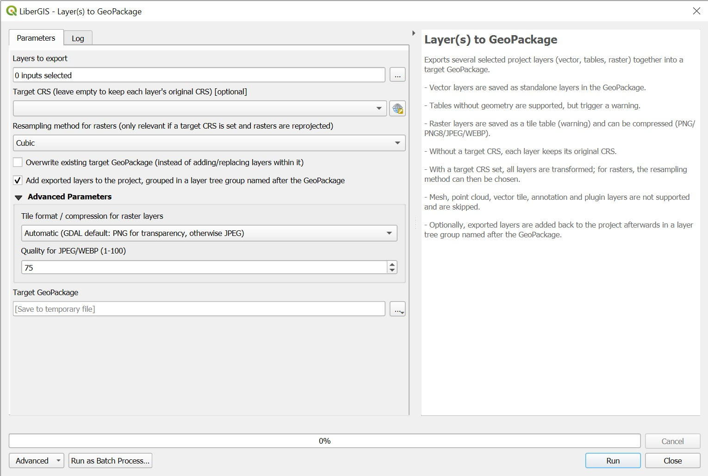

# Layer(s) to GeoPackage

A QGIS Processing script that bulk-exports a selection of layers already loaded in your project — vector, non-spatial tables, and raster — into a single target GeoPackage, and optionally reloads the result into the project as a tidy layer tree group.

## What it does

Given a list of project layers you tick in the Processing dialog, this tool:

- Writes vector layers as standalone tables in the target GeoPackage.
- Supports non-spatial tables (vector layers without geometry) too — GeoPackage has a dedicated "attributes" table type for these — with a warning logged so you're aware they're a different kind of content than a spatial layer.
- Supports raster layers, written as a tiled raster table, with a choice of tile format/compression (PNG, PNG8, JPEG, WEBP) and JPEG/WEBP quality — also logged with a warning, since raster-in-GeoPackage has real trade-offs (see Notes below).
- Leaves each layer's own CRS untouched by default — a GeoPackage can happily contain tables in different CRSs. Optionally, set a single target CRS to reproject everything into it, with a choice of resampling method for rasters.
- Logs each layer's extent before and after reprojection, and explicitly flags the case where a transform silently produced no change (a common symptom of a missing PROJ grid) rather than leaving you to guess from the numbers.
- Skips layer types that can't be meaningfully written to a GeoPackage (mesh, point cloud, vector tile, annotation, plugin layers), reporting each as an error rather than failing the whole run.
- Optionally reloads every successfully exported layer back into the project afterwards, collected in a layer tree group named after the GeoPackage, each keeping its original layer name.
- Cancellable mid-run, including partway through writing a single large layer, not just between layers.
- Robust to a couple of real-world rough edges: retries deleting an existing output file if Windows briefly still has it locked, and surfaces GDAL warnings that `gdal.UseExceptions()` alone would leave silent.

## Installation

This is a single-file **Processing script**, not a full plugin:

1. Download [`layers_to_geopackage.py`](https://github.com/preinzi/qgis-layers-to-geopackage/blob/main/layers_to_geopackage.py).
2. In QGIS: **Processing → Toolbox → Scripts (gear icon) → Add Script to Toolbox…**, and select the file.
3. It will appear under **Scripts → LiberGIS → Layer(s) to GeoPackage**.

No extra Python packages required beyond what ships with QGIS (uses only the Python standard library plus the bundled GDAL/PyQGIS). Tested on QGIS 3.34 and 3.44 LTR (Windows).

## Usage

| Parameter | Description |
| --- | --- |
| **Layers to export** | Any project layers, ticked from the list — vector, table, or raster |
| **Target GeoPackage** | Output `.gpkg` file. Can be a new or an existing file |
| **Target CRS** | Optional. Leave empty to keep each layer's own CRS; pick one to reproject everything into it |
| **Resampling method for rasters** *(default: Cubic)* | Only used when a target CRS is set and a raster actually needs reprojecting |
| **Tile format / compression for raster layers** *(Advanced, default: Automatic)* | PNG (lossless), PNG8, JPEG, or WEBP (lossy) |
| **Quality for JPEG/WEBP** *(Advanced, default: 75)* | 1–100, only relevant for those two formats |
| **Overwrite existing target GeoPackage** *(default: off)* | On: deletes and recreates the file. Off: adds to / replaces layers within an existing file |
| **Add exported layers to the project…** *(default: on)* | Reloads the result into the project, grouped in a layer tree group named after the GeoPackage |

### Output

Each exported layer becomes its own table in the target GeoPackage, named after the source layer (sanitized to a valid GeoPackage table name, with a numeric suffix if two selected layers would otherwise collide). With the loading option on, those tables are added back to the project as layers named after their *original* layer names, inside a layer tree group matching the GeoPackage's filename.

## Notes

- GeoPackage's raster storage is tile-based (like a basemap cache), designed for 8-bit imagery. It's a good fit for bundling a basemap alongside vector data into one portable file (e.g. for offline/field use), but not a general substitute for GeoTIFF — the tool logs a specific warning when a raster isn't 8-bit (e.g. a floating-point elevation model), since lossy tile formats are unsuitable for that kind of data and even lossless PNG can alter the values.
- A wildly implausible extent after reprojection isn't always a transform failure — a target CRS with a narrow area of use (e.g. a single UTM zone) applied to data with a much broader extent will genuinely produce extreme coordinates. The tool only raises its extent-based warning when the before/after coordinates are identical, which is a reliable sign of a silently failed transform.

## License

GPL-3.0-or-later — see [LICENSE](https://github.com/preinzi/qgis-layers-to-geopackage/blob/main/LICENSE).

## Credits

Written by Stephan Preinstorfer (LiberGIS) with help from Claude (Anthropic).

## Contributing

Issues and pull requests welcome.
